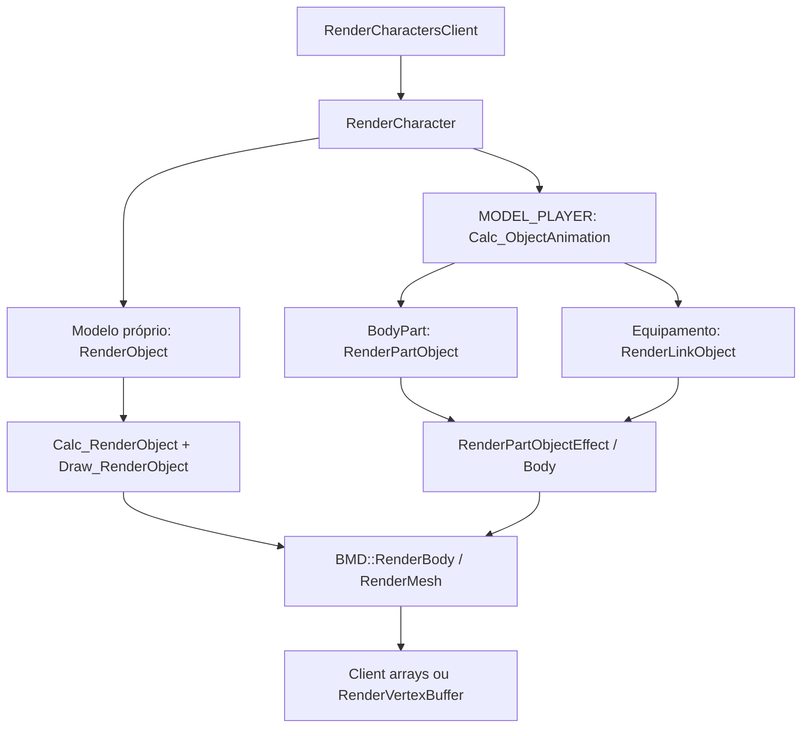

# Fase 1 — Main → contratos do renderer Diligent

Data: 10/09/2026. Base: `novo/modernization@13cfc7c3e5dab042e1c3e8f4184e18c26dd08eff`.
Source: `SRCMainGS/Source/Main5.2/source`.
Decisão: Diligent, OpenGL 4.6 primeiro, contratos compartilhados para Vulkan e Direct3D 11.

## Entrega e alcance

Esta fase fecha o **mapa estático dos caminhos iniciais e dos produtores/consumidores de dados**. Entrega callgraphs de personagens, BotBuffer, objetos, equipamentos e preview; contratos de geometria, pose, câmera, textura e material; pontos de captura e regras de ownership. Terreno, partículas e joints têm fronteiras de adaptação identificadas para fases posteriores.

Os nomes de contratos e serviços propostos abaixo ainda não são classes implementadas. Nenhum renderer foi ativado por esta entrega. A fase de contexto, a implementação dos layouts e a validação visual continuam abertas.

Não se declara exaustiva a semântica de todos os itens, mapas, scripts, cloth e efeitos. O ponto comum de captura foi localizado, mas hooks que saem antes dele exigem adaptadores próprios. Também não houve build Windows ou execução de cliente nesta fase.

## 1. Caminhos de chamada

### 1.1 Frame e separação por pass

Em [ZzzScene.cpp](https://github.com/zettoesports-glitch/novo/blob/13cfc7c3e5dab042e1c3e8f4184e18c26dd08eff/SRCMainGS/Source/Main5.2/source/ZzzScene.cpp), `RenderMainScene` prepara câmera/frustum, chama terreno e objetos em ordem dependente do mapa, depois `RenderCharactersClient`, itens, objetos posteriores aos personagens, joints, efeitos, sprites/partículas e UI.

Água pode abrir outra sequência com `BeginOpengl`, `RenderWaterTerrain`, joints e partículas. A ordem não é uma lista única válida para todos os mapas.

**Contrato:** cada comando recebe `ViewId`, `PassId` e `SubmissionOrder`. O primeiro adaptador preserva a ordem observada. Ordenação por PSO só será permitida dentro de segmentos comprovadamente reordenáveis.

### 1.2 Hero e jogadores remotos

Fontes: [ZzzCharacter.cpp](https://github.com/zettoesports-glitch/novo/blob/13cfc7c3e5dab042e1c3e8f4184e18c26dd08eff/SRCMainGS/Source/Main5.2/source/ZzzCharacter.cpp), [ZzzObject.cpp](https://github.com/zettoesports-glitch/novo/blob/13cfc7c3e5dab042e1c3e8f4184e18c26dd08eff/SRCMainGS/Source/Main5.2/source/ZzzObject.cpp), [ZzzBMD.cpp](https://github.com/zettoesports-glitch/novo/blob/13cfc7c3e5dab042e1c3e8f4184e18c26dd08eff/SRCMainGS/Source/Main5.2/source/ZzzBMD.cpp).

O diagrama representa caminhos comuns, não todos os branches. Há sombras, seleção, cloth e efeitos adicionais.

1. `RenderCharactersClient` percorre `gmCharacters->GetCharacter(i)`, aplica regras de visibilidade/cloaking e chama `RenderCharacter(c, &c->Object, Select)`.
2. O Hero participa do mesmo loop; a identidade local é `c == Hero`. `KIND_PLAYER` não identifica exclusivamente o Hero.
3. Para `MODEL_PLAYER`, o caminho normal seleciona `CHARACTER_ANIMATION` e chama `Calc_ObjectAnimation`.
4. `Calc_ObjectAnimation` copia ação, escala, origem e iluminação para o BMD e chama `BMD::Animation`. A saída pode ser `o->BoneTransform` ou o array global.
5. O loop de `BodyPart` resolve modelo, skin e opções; chama `RenderPartObject`, que transforma a malha e encaminha efeitos/materiais.
6. `RenderPartObjectEffect` escolhe passes e chama `RenderPartObjectBody` / `RenderPartObjectBodyColor`. Estes chegam a `BMD::RenderBody` e/ou `RenderMesh`, salvo hooks que interceptam antes.
7. `RenderMesh` resolve textura/estado, expande vértices e desenha com client arrays ou caminho experimental `RenderVertexBuffer`.

**Ponto de adaptação:** propagar contexto de instância desde `RenderCharacter`; capturar a pose produzida antes de outro consumidor sobrescrever os globais; capturar material efetivo na resolução do mesh. Interceptar somente `RenderBody` deixa chamadas diretas a `RenderMesh` descobertas.

**Estado local/remoto:** capturar índice de slot + geração, chave do personagem, modelo e identidade local. Reutilização de slot em `CreateCharacter` invalida a geração anterior. Não usar ponteiro cru ou apenas tipo de modelo como chave durável.

### 1.3 BotBuffer — cadeia confirmada

Fontes: [GameServer/BotBuffer.cpp](https://github.com/zettoesports-glitch/novo/blob/13cfc7c3e5dab042e1c3e8f4184e18c26dd08eff/SRCMainGS/Source/GameServer/GameServer/BotBuffer.cpp), [GameServer/Monster.cpp](https://github.com/zettoesports-glitch/novo/blob/13cfc7c3e5dab042e1c3e8f4184e18c26dd08eff/SRCMainGS/Source/GameServer/GameServer/Monster.cpp), [GameServer/Viewport.cpp](https://github.com/zettoesports-glitch/novo/blob/13cfc7c3e5dab042e1c3e8f4184e18c26dd08eff/SRCMainGS/Source/GameServer/GameServer/Viewport.cpp), [WSclient.cpp](https://github.com/zettoesports-glitch/novo/blob/13cfc7c3e5dab042e1c3e8f4184e18c26dd08eff/SRCMainGS/Source/Main5.2/source/WSclient.cpp).

| Etapa | Evidência |
|---|---|
| Criação | `ObjBotBuffer::MakeBot` define `IsBot = 2` e chama `gObjSetBots` |
| Tipo no servidor | `gObjSetBots` define `Type = OBJECT_BOTS` |
| Envio | `CViewport::GCViewportPlayerSend` aceita `OBJECT_USER` e `OBJECT_BOTS`, usa pacote `0x12` e `ViewportConstructPlayer` |
| Recepção | Dispatch `0x12` → `ReceiveCreatePlayerViewport` |
| Objeto no Main | `CreateCharacter(Key, MODEL_PLAYER, ...)`; depois `o->Kind = KIND_PLAYER` |
| Desenho | Mesmo caminho remoto descrito em 1.2 |

Isso confirma a forma de representação no código, não o funcionamento do pacote em um build executado. Não inferir que o cliente recebe o campo servidor `IsBot`. Para a migração inicial, tratar todo `c != Hero` como instância não local; não criar um detector de bot por nome, classe ou Kind.

### 1.4 NPCs, monstros e objetos de mundo

`ReceiveCreateMonsterViewport` em [WSclient.cpp](https://github.com/zettoesports-glitch/novo/blob/13cfc7c3e5dab042e1c3e8f4184e18c26dd08eff/SRCMainGS/Source/Main5.2/source/WSclient.cpp) chama `CreateMonster` e mantém o personagem para o loop comum. `RenderCharacter` normalmente seleciona `CHARACTER_RENDER_OBJ` quando o modelo não é `MODEL_PLAYER`; NPCs e monstros possuem exceções específicas, cloth e afterimages.

`RenderObject` → `Calc_RenderObject` → `Draw_RenderObject` → draws BMD. `Calc_RenderObject` também faz seleção/contorno e pode produzir desenhos antes de retornar. Portanto, não é uma função pura de cálculo.

Objetos de mundo: `RenderObjects` percorre blocos de objetos, visibilidade e regras do mapa, chegando a `RenderObject`. `RenderObjects_AfterCharacter` usa um pass separado. Fontes: [ZzzObject.cpp](https://github.com/zettoesports-glitch/novo/blob/13cfc7c3e5dab042e1c3e8f4184e18c26dd08eff/SRCMainGS/Source/Main5.2/source/ZzzObject.cpp).

**Contrato:** mesma representação de draw BMD, mas preservar categoria, pass e identificador de objeto com geração; `ExtraMon`, `Select`, HiddenMesh e regras do mapa devem ser resolvidos antes da submissão.

### 1.5 Armas, asas e attachments

Em [ZzzCharacter.cpp](https://github.com/zettoesports-glitch/novo/blob/13cfc7c3e5dab042e1c3e8f4184e18c26dd08eff/SRCMainGS/Source/Main5.2/source/ZzzCharacter.cpp), `RenderLinkObject`:

- lê `PART_t::LinkBone` do objeto pai via `GetBoneTransform`;
- calcula offset/rotação e `ParentMatrix`;
- usa frames e ação próprios da peça;
- chama `pModel->Animation(BoneTransform, ..., Parent=true, Translate=true)`;
- transforma a peça e chama `RenderPartObjectEffect`.

**Contrato:** cada peça recebe snapshot próprio de pose/origem/escala e identidade do pai + slot da peça. Não compartilhar automaticamente o BoneOffset do corpo. Conservar a pose CPU para attachments, efeitos e cloth.

### 1.6 Inventário, item arrastado e preview

Fontes: [NewUI3DRenderMng.cpp](https://github.com/zettoesports-glitch/novo/blob/13cfc7c3e5dab042e1c3e8f4184e18c26dd08eff/SRCMainGS/Source/Main5.2/source/NewUI3DRenderMng.cpp), [NewUIInventoryCtrl.cpp](https://github.com/zettoesports-glitch/novo/blob/13cfc7c3e5dab042e1c3e8f4184e18c26dd08eff/SRCMainGS/Source/Main5.2/source/NewUIInventoryCtrl.cpp), [ZzzInventory.cpp](https://github.com/zettoesports-glitch/novo/blob/13cfc7c3e5dab042e1c3e8f4184e18c26dd08eff/SRCMainGS/Source/Main5.2/source/ZzzInventory.cpp).

`CNewUI3DCamera::Render` → `INewUI3DRenderObj::Render3D` → `CNewUIInventoryCtrl::Render3D` ou `CNewUIPickedItem::Render3D` → `RenderItem3D` → `RenderObjectScreen` → `RenderPartObject` → material/mesh.

A câmera altera projeção, viewport e depth; limpa o depth buffer. `RenderObjectScreen` usa `ObjectSelect`, avalia pose no array global e cria `CHARACTER Armor` local na pilha.

**Regra obrigatória:** copiar todos os dados antes do retorno; nunca enfileirar `&Armor.Object` ou referência ao array global para leitura posterior. Usar `ViewId = ItemPreview`, identificação temporária por frame/comando e iluminação explícita. O model renderer NextMU consultado retorna quando terrain é nulo; essa dependência deve ser removida na adaptação para previews. Evidência: [NextMU/mu_modelrenderer.cpp](https://github.com/kuncarous/nextmu/blob/ef0ad8268398decda2559ff376acf6c8bb40599c/client/game/src/mu_modelrenderer.cpp).

## 2. Contratos CPU → renderer

Estas são decisões de integração para implementação posterior. Dados imutáveis de asset são compartilhados; dados mutáveis são copiados para o frame.

| Contrato proposto | Produtor real no Main | Dados que atravessam a fronteira | Consumidor proposto |
|---|---|---|---|
| FrameData | WorldTime e sequência de RenderMainScene | frameId, tempo na unidade original, cenário e sequência | FrameScheduler |
| ViewData | BeginOpengl / CNewUI3DCamera::Render | view, projection, viewport, depth range, target, fog e luz | Câmera/PSO do pass |
| InstanceData | RenderCharacter / RenderObject / RenderObjectScreen | id+geração, modelo, origem, escala, alpha, seleção, pose, categoria | ModelRenderer |
| PoseSnapshot | BMD::Animation e alterações subsequentes | cópia de NumBones matrizes 3×4, espaço e política de escala/origem | SkeletonUploader |
| MeshAsset | BMD::Meshs e estruturas de ZzzBMD.h | posição, normal, UV, bones separados, ID original de vértice, triângulos | MeshCache / IBuffer |
| MaterialDraw | RenderPartObjectEffect / BMD::RenderBody / RenderMesh | textura resolvida, cor, iluminação, flags efetivos, blend, depth, cull, alpha test, UV | MaterialResolver / PSO / SRB |
| TextureResource | CGlobalBitmap | ID lógico+geração, pixels, formato, mipmaps, sampler e uso de cor | ITexture / ITextureView |
| AttachmentData | RenderLinkObject | pai, bone de ligação, transform local e pose própria da peça | Mesmo ModelRenderer |
| DynamicGeometry | terreno/partículas/joints/cloth | vértices no espaço declarado, índices, material e pass | Renderers específicos |

### 2.1 Geometria BMD

Evidência: [ZzzBMD.h](https://github.com/zettoesports-glitch/novo/blob/13cfc7c3e5dab042e1c3e8f4184e18c26dd08eff/SRCMainGS/Source/Main5.2/source/ZzzBMD.h) e `BMD::Transform/RenderMesh` em [ZzzBMD.cpp](https://github.com/zettoesports-glitch/novo/blob/13cfc7c3e5dab042e1c3e8f4184e18c26dd08eff/SRCMainGS/Source/Main5.2/source/ZzzBMD.cpp).

| Dado de origem | Campo de destino lógico | Regra |
|---|---|---|
| Meshs[i].Vertices[Triangle.VertexIndex[k]].Position | Position | Posição original do asset; não VertexTransform já deformado |
| Vertex_t.Node | PositionBone | Validar sinal e limite NumBones antes de converter |
| Meshs[i].Normals[Triangle.NormalIndex[k]].Normal | Normal | Não assumir que normalIndex = vertexIndex |
| Normal_t.Node | NormalBone | Pode ser diferente de PositionBone |
| TexCoords[Triangle.TexCoordIndex[k]] | UV | Definir uma única conversão de V no adaptador |
| Triangle.VertexIndex[k] | OriginalVertexId | Usado pelo wave; não trocar pelo índice do triângulo expandido |
| Triangle.Polygon / NumTriangles | Topology / count | Validar polígonos; não presumir todo asset como triângulo sem checagem |
| Mesh_t.Texture / BMD::IndexTexture | TextureId inicial | Ainda sujeito a skin, água e override por draw |

Layout inicial **proposto**, sem compressão: Position float3 no offset 0; Normal float3 no 12; UV float2 no 24; PositionBone/NormalBone uint16 no 32/34; OriginalVertexId uint32 no 36; stride 40. Deve ser declarado com tipos de tamanho fixo e verificado por sizeof/offsetof no build da fase de contratos. Não é o ABI existente do Main nem o layout binário NextMU.

O shader HLSL recebe ATTRIB0=float3, ATTRIB1=float3, ATTRIB2=float2, ATTRIB3=uint2, ATTRIB4=uint. A source NextMU usa outros tamanhos físicos para os índices; o layout Diligent do adaptador precisa refletir nossa escolha, não ser copiado cegamente. Evidências: [shader.vs](https://github.com/zettoesports-glitch/novo/blob/13cfc7c3e5dab042e1c3e8f4184e18c26dd08eff/Resources_DE_2024-01-25/data/shaders/models/texture/shader.vs), [NextMU/t_graphics_layouts.cpp](https://github.com/kuncarous/nextmu/blob/ef0ad8268398decda2559ff376acf6c8bb40599c/client/game/src/t_graphics_layouts.cpp).

### 2.2 Pose, origem e escala

`OBJECT::GetBoneTransform()` retorna o ponteiro do objeto; **não faz fallback** ao array global. A escolha deve seguir explicitamente `EnableBoneMatrix` e o caminho produtor. Evidência: [w_ObjectInfo.cpp](https://github.com/zettoesports-glitch/novo/blob/13cfc7c3e5dab042e1c3e8f4184e18c26dd08eff/SRCMainGS/Source/Main5.2/source/w_ObjectInfo.cpp).

- Snapshot CPU canônico: matrizes 3×4 da pose avaliada, copiadas antes de reutilização.
- `BMD::Transform` usa bone da posição e bone da normal separadamente; com Translate aplica BodyScale e BodyOrigin aos vértices. BoneScale modifica expansão dos vértices em torno das translações dos bones.
- Registrar no snapshot se a origem/escala já foi aplicada. Não somar BodyOrigin duas vezes.
- BodyHeight, ParentMatrix e ajustes de peças devem ser capturados no estágio em que já produziram efeito sobre a pose.
- Afterimages podem exigir várias poses do mesmo objeto no mesmo frame; chave deve incluir revisão/poseId, não só entityId.
- O formato compacto NextMU de dois texels por osso requer conversão matemática e validação de representabilidade. Não enviar bytes de matriz 3×4 como se fossem quaternion + translação/escala. Preservar um caminho de matriz quando houver transformação não representável.

### 2.3 Material e textura: ordem de resolução

Em `RenderMesh`, o material final depende de mais do que RenderFlag:

1. Mesh.Texture → IndexTexture; regras de ocultação e LightTexture.
2. Skin/HideSkin, WaterTextureNumber e override MeshTexture.
3. TextureScript, NoneBlendMesh, StreamMesh, BlendMesh e deslocamento UV.
4. BodyLight/LightEnable e intensidade por normal.
5. Precedência de COLOR, chrome/metal/oil, TEXTURE, BRIGHT/DARK e variantes.
6. Componentes RGB/RGBA da textura e estado herdado relevante.
7. Overrides finais, como NODEPTH e DOPPELGANGER.

Preservar essa precedência. BlendMesh aparece tanto em comparações por índice de mesh quanto por `m->Texture`; não unificar sem reproduzir cada condição.

`BindTexture(int)` interpreta valores não negativos como ID lógico em Bitmaps e negativos como handle OpenGL direto. O novo contrato separa `TextureId` de `ExternalTexture`; sinal negativo não pode se tornar ID Diligent. Fonte: [ZzzOpenglUtil.cpp](https://github.com/zettoesports-glitch/novo/blob/13cfc7c3e5dab042e1c3e8f4184e18c26dd08eff/SRCMainGS/Source/Main5.2/source/ZzzOpenglUtil.cpp).

`CGlobalBitmap::CreateMipmappedTexture` cria o objeto GL; `UnloadImage` o destrói. O adaptador deve invalidar a geração do recurso e manter referências vivas até o término dos comandos. Fonte: [GlobalBitmap.cpp](https://github.com/zettoesports-glitch/novo/blob/13cfc7c3e5dab042e1c3e8f4184e18c26dd08eff/SRCMainGS/Source/Main5.2/source/GlobalBitmap.cpp).

### 2.4 Estados explícitos de pipeline

Tabela derivada dos helpers em [ZzzOpenglUtil.cpp](https://github.com/zettoesports-glitch/novo/blob/13cfc7c3e5dab042e1c3e8f4184e18c26dd08eff/SRCMainGS/Source/Main5.2/source/ZzzOpenglUtil.cpp). “Preserva” significa que o helper não fixa esse estado e a captura precisa resolvê-lo no contexto atual.

| Helper legado | Blend src/dst | Depth write | Cull | Alpha test |
|---|---|---|---|---|
| DisableAlphaBlend | desativado | ligado | ligado | desligado |
| EnableAlphaTest(true) | SRC_ALPHA / ONE_MINUS_SRC_ALPHA | ligado | desligado | ligado |
| EnableAlphaTest(false) | SRC_ALPHA / ONE_MINUS_SRC_ALPHA | preserva | desligado | ligado |
| EnableAlphaBlend | ONE / ONE | desligado | desligado | desligado |
| EnableAlphaBlendMinus | ZERO / ONE_MINUS_SRC_COLOR | desligado | desligado | desligado |
| EnableAlphaBlend2 | ONE_MINUS_SRC_COLOR / ONE | desligado | desligado | desligado |
| EnableAlphaBlend3 | SRC_ALPHA / ONE_MINUS_SRC_ALPHA | desligado | desligado | desligado |
| EnableAlphaBlend4 | ONE / ONE_MINUS_SRC_COLOR | desligado | desligado | desligado |

Esses helpers não fixam todos os estados. A equação de blend, depth test/function, stencil, color mask e fog também precisam integrar o estado efetivo. BeginOpengl configura LEQUAL e alpha comparison GREATER 0.25; overrides posteriores prevalecem. “AlphaTest” aqui pode habilitar também blending, não apenas discard.

PipelineKey proposto: shader/permutation, vertex layout, topology, blend completo, depth/stencil, rasterizer, formatos RTV/DSV e amostragem. SRB key: pipeline/layout de recursos + texturas/views/samplers com geração. Cor, tempo, pose e deslocamento UV são dados por draw, não motivo para criar um PSO por entidade.

### 2.5 Correspondência com os shaders NextMU

| Entrada HLSL/recurso | Origem/adaptação Main |
|---|---|
| ModelViewProj.Model / ViewProj | Transformação declarada da instância e ViewData; convenção de matriz documentada |
| g_SkeletonTexture / g_BoneOffset | PoseSnapshot convertido pelo uploader; offset válido no frame |
| g_LightPosition | Vetor efetivo produzido por BMD::Transform, incluindo HighLight/ShadowAngle/mapa |
| g_BodyLight / g_EnableLight | Cor e modo efetivos no draw; não ler BMD compartilhado na execução |
| g_BodyOrigin | Origem conforme contrato de pose; usada também por sombra projetada |
| g_NormalScale | Política de expansão compatível; não equivale cegamente ao BoneScale multiplicativo |
| g_AlphaTest / g_PremultiplyAlpha | Política de discard e premultiplicação do material, com cor consistente |
| g_WorldTime | WorldTime preservando unidade e fatores usados nas fórmulas |
| g_BlendTexCoord | Deslocamento UV após resolução de StreamMesh/BlendMesh |
| g_ZTestRef | Clipping espacial específico; não converter de glDepthFunc |
| g_Texture | Textura lógica já resolvida e seu sampler |
| g_VertexTexture | Somente material que a requer; Main oil não implica automaticamente asset de oil NextMU |
| cbCameraAttribs / cbLightAttribs | Estruturas compatíveis com o shader selecionado, fornecidas pelo pass |

`g_Dummy1` no Resource 2024 e `BlendMeshLight` no NModelSettings da source 2025 ocupam papel nominal diferente. A fase de ABI deve verificar cada shader e tamanho/alinhamento do cbuffer; não declarar equivalência apenas pela posição do campo. Evidência: [NextMU/mu_modelrenderer.h](https://github.com/kuncarous/nextmu/blob/ef0ad8268398decda2559ff376acf6c8bb40599c/client/game/include/mu_modelrenderer.h).

Câmera e luz são fornecidas explicitamente para previews sem terreno. A adaptação HLSL deve preservar a convenção escolhida de eixos e transposição; a conversão `.xzyw` do shader de referência não deve ser somada a outra troca de eixos no CPU.

## 3. Fronteiras dos caminhos posteriores

| Caminho | Produtor e consumidor localizados | Decisão para migração |
|---|---|---|
| Terreno | RenderTerrain → RenderTerrainFrustrum → RenderTerrainBlock → RenderTerrainTile/Face | Adaptar TerrainNormal/Light/Height, mapping layers, alpha, wall e WaterMove; preservar passes de grama e pointers |
| Partículas | RenderParticles → RenderSprite e variantes | Posição mundo transformada por CameraMatrix em RenderSprite; BeginSprite deixa modelview identidade. Declarar vértices em view space quando aplicável |
| Joints | RenderJoints → construção de caudas e draws GL_QUADS | Buffer dinâmico de triângulos com posição/cor/UV e pass de água preservado |
| Objetos posteriores | RenderObjects_AfterCharacter | Não fundir com objetos anteriores sem análise de dependência |
| UI 2D | RenderBitmap e helpers | ViewData ortográfica e textura/alpha explícitos |
| Scripts/grupos | CGMRenderGroupMesh::runtime_make_render → BMD::RenderBody/RenderMesh | Capturar parâmetros e cor efetivos; RenderFlag negativo tem semântica de encaminhar corpo |
| Cloth e hooks | RenderPartObject / RenderPartObjectBody | Desenhos que interceptam antes do BMD exigem bridge próprio; permanecem fora do primeiro BMD |

Fontes: [ZzzLodTerrain.cpp](https://github.com/zettoesports-glitch/novo/blob/13cfc7c3e5dab042e1c3e8f4184e18c26dd08eff/SRCMainGS/Source/Main5.2/source/ZzzLodTerrain.cpp), [ZzzEffectParticle.cpp](https://github.com/zettoesports-glitch/novo/blob/13cfc7c3e5dab042e1c3e8f4184e18c26dd08eff/SRCMainGS/Source/Main5.2/source/ZzzEffectParticle.cpp), [ZzzEffectJoint.cpp](https://github.com/zettoesports-glitch/novo/blob/13cfc7c3e5dab042e1c3e8f4184e18c26dd08eff/SRCMainGS/Source/Main5.2/source/ZzzEffectJoint.cpp), [CGMRenderGroupMesh.cpp](https://github.com/zettoesports-glitch/novo/blob/13cfc7c3e5dab042e1c3e8f4184e18c26dd08eff/SRCMainGS/Source/Main5.2/source/CGMRenderGroupMesh.cpp).

## 4. Pontos de captura e regras de execução

| Ponto | Captura | Momento e lifetime |
|---|---|---|
| Entrada RenderCharacter/RenderObject/RenderObjectScreen | Instância, categoria, view/pass | Contexto explícito propagado até mesh; scope aninhado para peça/preview |
| Após pose/ajustes | PoseSnapshot | Cópia imediata; armazenamento do frame, nunca referência ao scratch global |
| RenderPartObject/RenderLinkObject | Origem/escala e peça | Antes de outro modelo reutilizar BMD/ParentMatrix |
| Resolução final RenderMesh | MaterialDraw e mesh | Antes de executar draw; conservar efeitos colaterais necessários durante transição |
| CGlobalBitmap load/unload | TextureResource | Asset persistente; geração e descarte adiado |
| Início/fim de pass | ViewData e estado efetivo | Não inferir câmera a partir de uma leitura tardia do estado OpenGL |

Fluxo proposto:
`Snapshot CPU → ResolveMesh/Material → UploadPose → SetPipelineState → SetVertexBuffers → CommitShaderResources → Draw`.
Esses nomes Diligent são uma descrição do consumidor futuro, não código já integrado.

A execução deve reter dados do frame e recursos até consumo seguro; não reutilizar upload de pose enquanto GPU ainda lê. Resize, swapchain e apresentação pertencem ao dispositivo/pass, não ao gameplay.

### Achados que afetam a implementação

- `BMD::RenderMesh` muta BodyLight em algumas branches chrome/bright quando Alpha < 0.99. Capturar antes/depois conforme o pass; remover a mutação sem estudar a sequência pode mudar passes seguintes.
- No branch RENDER_SHADOWMAP inspecionado em RenderMesh, a projeção é calculada em uma variável local `pos`, sem cópia de volta ao array de vértices. Isso é uma divergência estática potencial; não generalizar para RenderBodyShadow nem afirmar resultado visual sem executar.
- `RenderMesh` percorre Triangle.Polygon, mas o draw legado usa NumTriangles * 3. O importador deve detectar inconsistência.
- `SHADER_VERSION_TEST` está comentado em Defined_Global.h; mesmo o caminho experimental recebe posições já transformadas. A presença de VBO não comprova skinning GPU.
- Funções de render do Main também atualizam estado, animação de peças, cloth e efeitos. Separar extração de comandos de simulação exige preservar esses efeitos colaterais.
- Corrigir tais achados é trabalho de implementação posterior; esta fase registra os pontos e a política necessária.

## 5. Gates para as próximas fases

A fase 1 está concluída como documentação estática dos caminhos iniciais porque os produtores e destinos estão identificados e os casos críticos têm regra de integração explícita.

Antes de implementar o BMD:
- [ ] Fixar versão/commit Diligent, arquitetura, CRT e versão de shaders.
- [ ] Validar contexto OpenGL 4.6, profile, apresentação e coexistência com legado.
- [ ] Implementar contratos/layouts com verificação de ABI e conversão matemática de pose.
- [ ] Capturar Hero + remoto + BotBuffer com poses e materiais diferentes.
- [ ] Comparar item no mundo, item no inventário e arma ligada ao bone.
- [ ] Exercitar reutilização de slot, troca de mapa, unload de textura e câmera de preview.
- [ ] Verificar transparência, seleção, wave e sombras como passes separados.

Esses gates não foram marcados como executados. Compilação dos 105 programas, equivalência de todas as permutations, engenharia reversa binária adicional e paridade das três APIs continuam fora desta fase.

## 6. Evidência e reprodução

As referências deste documento fixam o commit de origem, permitindo verificar o mapa mesmo depois de novos commits. Buscas usadas: declarações e chamadas RenderMainScene, RenderCharactersClient, RenderCharacter, Calc_ObjectAnimation, RenderPartObject, RenderLinkObject, RenderObjectScreen, RenderMesh, BoneTransform, BindTexture e GCViewportPlayerSend.

A revisão cruzou código de Main, GameServer e os contratos HLSL/NextMU citados. Código NextMU de 2025 é referência de source; não comprova sozinho o ABI nem todos os comportamentos dos binários Resources 2024.
